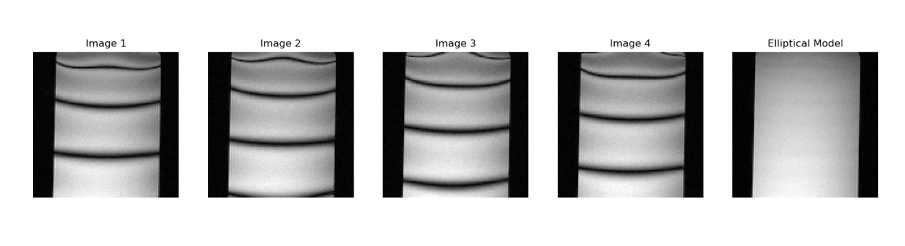
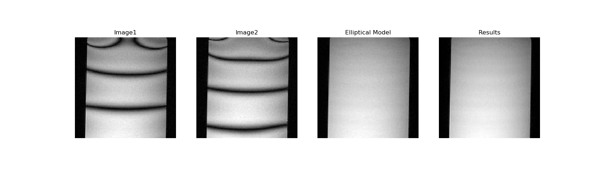

# tensorflow-ssfp-smoothing
Implementation of a deep learning model (using tensorflow) for SSFP band removal in MRI images

Four phased cycled SSFP images were taken with a 3D MRI Scanner of a phantom, and the Ellpitical Singal Model was used to generate an image with the bands removed as shown:

A deep learning model using the unet architecture was created to remove the banding artifacts. As input to the model, 2 phase cycled images were taken with the image generated from the Ellpitical Singal Model used as truth data. This deep learning model was implemented in tensorflow and trained for 10000 epochs. The results are as shown: 

