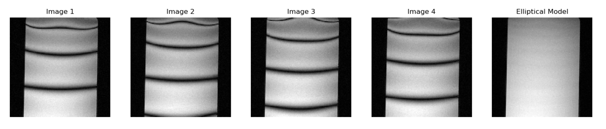
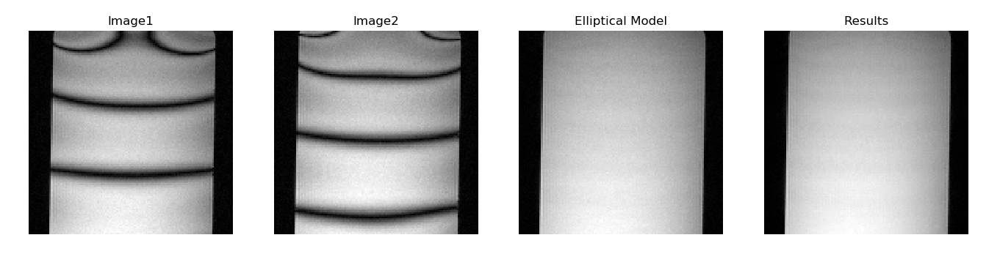

# DeepSSFP 

DeepSSFP is library for medical imaging using SSFP. This library contains code implementations for a variety of deep learning techniques for accelerated bSSFP MRI imaging. These techiques are as follows:

1. Deep Learning for bSSFP Banding Reduction
2. Synthetic Banding for bSSFP Data Augmentation
3. Deep Learning Super-FOV for Accelerated bSSFP Banding Reduction

## Notebooks

Jupyter notebooks for examples of how to use the DeepSSFP library.

1. Deep Learning bSSFP Banding Reduction ([notebook](notebooks/deepssfp_bandremoval2_experiment_v0.ipynb))
2. Synthetic Banding for bSSFP Data Augmentation ([notebook](notebooks/deepssfp_syntheticbanding_experiment_v0.ipynb))
3. Super-FOV for Accelerated bSSFP Banding Reduction ([notebook](notebooks/deepssfp_superfov_experiment_v0.ipynb))

## Development

This project requires python 3.8+ and has the following dependancies: 
numpy, matplotlib, scikit-image, mapvbvd, tensorflow and jupyterlab.

To setup a python enviroment with conda:

1. Create a new conda environment from scatch 
> ```
> conda create -n deepssfp python=3.8 
> conda activate deepssfp
> ```
> Then install packages with pip:
> ```
> pip install numpy matplotlib scipy scikit-image seabornpy mapvbvd tensorflow jupyterlab 
> ```

- Run to API server
```
npm run api
```

## Features

Implementations variety of deep learning techniques SSFP Band Removal is incomed in this library. 

### Deep Learning for bSSFP Banding Reduction

Four phased cycled SSFP images were taken with a 3D MRI Scanner of a phantom, and the Ellpitical Singal Model was used to generate an image with the bands removed as shown:



A deep learning model using the unet architecture was created to remove the banding artifacts. As input to the model, 2 phase cycled images were taken with the image generated from the Ellpitical Singal Model used as truth data. This deep learning model was implemented in tensorflow and trained for 10000 epochs. The results are as shown: 



### Synthetic Banding for bSSFP Data Augmentation
### Deep Learning Super-FOV for Accelerated bSSFP Banding Reduction


