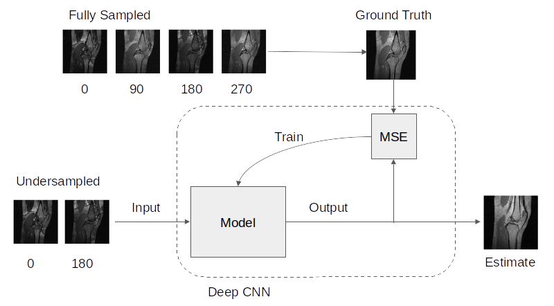
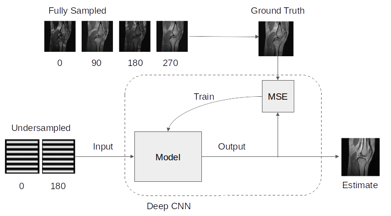
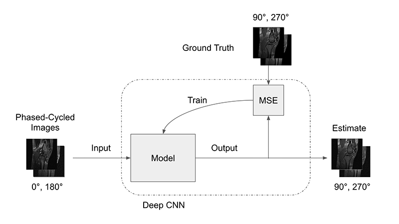

# DeepSSFP 

DeepSSFP is library for image reconstuction for bSSFP. This library contains code implementations for a variety of deep learning techniques for accelerated bSSFP MRI imaging. These techiques are as follows:

1. Deep Learning for bSSFP Banding Reduction
2. Deep Learning Super-FOV for Accelerated bSSFP Banding Reduction
3. Synthetic Banding for bSSFP Data Augmentation for Banding Reduction
4. Synthetic Banding for bSSFP Data Augmentation for T1/T2 Map Estimation

## Introduction

SSFP is sensitive to off-resonance effects, which cause banding artifacts. Multiple SSFP images with different phase cycle amounts can be combined to suppress banding artifacts and for the estimation of quantitative biomarker like T1/T2 relaxation parameter mappings. Multiple methods for band suppression have been developed over the years, but each method has limitations. Often the most significant limitation for effective band reduction is the number of phased-cycled SSFP images required. Our research aimed to develop a machine learning-based model to combine multiple bSSFP images for improved banding artifact suppression and quantitative biomarker estimation with a reduced number of bSSFP acquisitions.

## Notebooks

Jupyter notebooks for examples of how to use the DeepSSFP library.

1. Deep Learning bSSFP Banding Reduction ([notebook](notebooks/deepssfp_bandremoval2_experiment_v0.ipynb))
2. Super-FOV for Accelerated bSSFP Banding Reduction ([notebook](notebooks/deepssfp_superfov_experiment_v0.ipynb))
3. Synthetic Banding for bSSFP Data Augmentation ([notebook](notebooks/deepssfp_syntheticbanding_experiment_v0.ipynb))

## Development

This project requires python 3.8+ and has the following dependancies: 
numpy, matplotlib, scikit-image, mapvbvd, tensorflow and jupyterlab.

To setup a python enviroment with conda:

1. Create a new conda environment from scatch 
> ```
> conda create -n deepssfp python=3.8 
> conda activate deepssfp
> ```
> Then install packages with pip:
> ```
> pip install numpy matplotlib scipy scikit-image seabornpy mapvbvd tensorflow jupyterlab 
> ```

- Run to API server
```
npm run api
```

## Features

Implementations variety of deep learning techniques SSFP Band Removal is incomed in this library. 

### Deep Learning for bSSFP Banding Reduction

<p align="center">
  
</p>

SSFP banding artifact reduction can be recast as a supervised learning task. The relationship between multiple acquisition bSSFP image data and a band-free image emerges during the supervised learning from training. Applying supervised learning to banding artifact reduction reduces scan time by reducing the required number of phase-cycled bSSFP acquisitions. A U-Net architecture was designed and trained to model the elliptical signal model for band removal. Banding artifact-free images were generated as the ground truth data and the target image for training an end-to-end deep learning network. 

<p align="center">
  
</p>

The ground truth data was generated using four phased cycled images as inputs to the elliptical signal model to generate a band-reduced image. 
An example data using standard MRI imaging phantom with four phased cycled images and a band-reduced image are shown. 

<p align="center">
  
</p>

Banding artifact-free images were generated using our model. The results of the band reduction using our deep learning models were compared against multiple standard methods for banding artifact suppression, including the maximum-intensity project (MIP), the elliptical signal model, and the sum of squares.

### Deep Learning Super-FOV for Accelerated bSSFP Banding Reduction

<p align="center">
  
</p>

We present a machine learning technique for bSSFP band removal using two undersampled phase-cycled bSSFP image acquisitions. A deep convolutional neural network was trained to solve a generalized SENSE reconstruction problem where bSSFP banding sensitivities are used instead of coil sensitivity maps. We demonstrate that a deep neural network can reduce banding artifacts in multiple acquisition bSSFP comparable to the elliptical signal model and reduce overall scan time by requiring half as many phase-cycled images.

### Synthetic Banding for bSSFP Data Augmentation

<p align="center">
  
</p>

We present a deep learning method for synthesizing additional phase-cycled images from a set of at least two phase-cycled images that can be used with existing band reduction techniques to reduce scan time.


